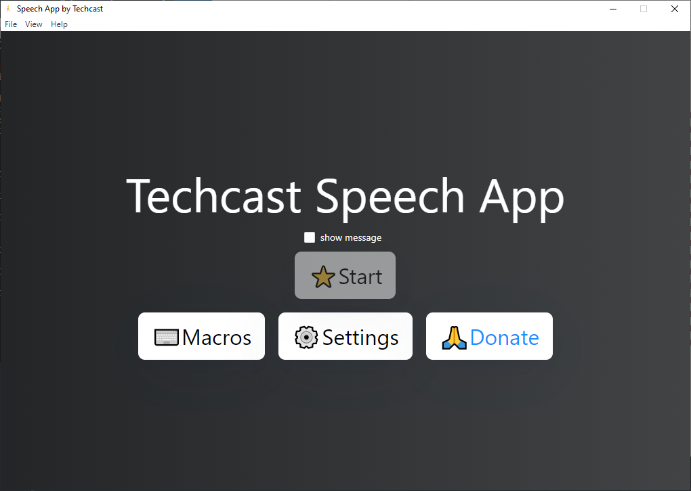
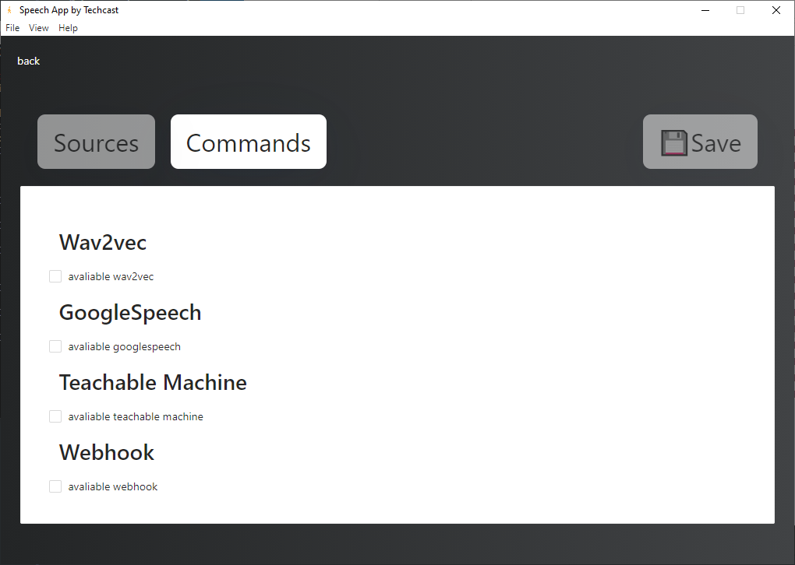
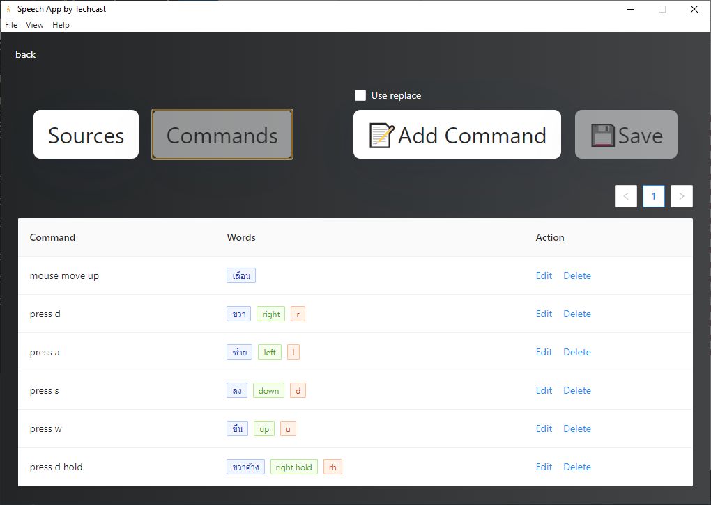
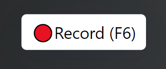
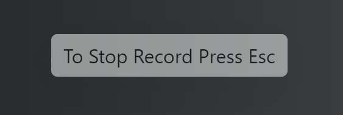
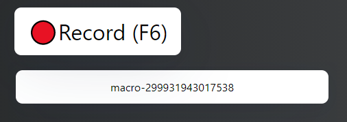
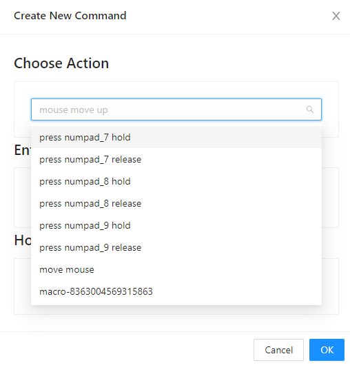

# Speech App คืออิหยังนะ
Speech App อันนี้คือ โปรแกรมที่เขียนขึ้นสำหรับทำให้ Speech Recognition ควบคุมคอมพิวเตอร์ได้ ด้วยคำสั่งเสียง

# คำเตือน
นี้เป็นโปรแกรมใช้ส่วนตัว ไม่ได้มีไว้ใช้เชิงพาณิชย์ และ Techcast ไม่ได้เป็น IT Support ของโปรแกรมนี้ ดังนั้น
USE AT YOUR OWN RISK นะครับ

# สิ่งที่ทำได้
- ใช้ Speech Recognition ได้หลายแบบ
    - Google Speech Api
    - Wav2vec2 Thai (Model จาก AIResearch)
    - Teachable Machine
- แก้ไข/ตั้งรูปแบบคำสั่งเอง
- บันทึก และ ตั้ง Macro ให้เป็นคำสั่งใหม่

# วิธีใช้
### หน้าจอจะเป็นแบบนี้
- ปุ่ม Start ยังกดไม่ได้ เพราะยังไม่ได้ไป เลือก Model

### ให้เข้าไปที่ Settings จะมี Model ให้เลือก 3 อัน

- Wav2vec (รับแค่ภาษาไทย, กิน memory และ VRAM แต่ทำงานค่ดเร็ว)

- Google Speech (ได้ทั้งไทย และ อังกฤษ, ไม่กิน RAM, แต่ทำงานช้า)

- Teachable machine (ใช้ Custom Speech model ง่ายๆจาก Teachable machine)
    - แล้วจะไปเอา model มาไง
        - เข้าไปที่ https://teachablemachine.withgoogle.com/
        - เลือก Audio Project
        - Train model ให้เรียบร้อย
        - Upload model
        - เอา sharable link มาใส่

- Webhook (ส่ง POST http ไปให้ server อื่นได้)

### Command Setting
command คือ สิ่งที่จำให้คอมทำงาน, ส่วน words คือคำพูดที่ถ้าพบจะทำงาน (use replace ไว้ใช้สำหรับ ใช้คู่กับ webhooks)

### Macro
record macro (press f6 or click button)

stop record macro (press esc)

when finish record you will see random macro name happen.

hover it. To see options.
options
- play (left)
- rename (middle)
- delete (right)

you can make your macro as action
